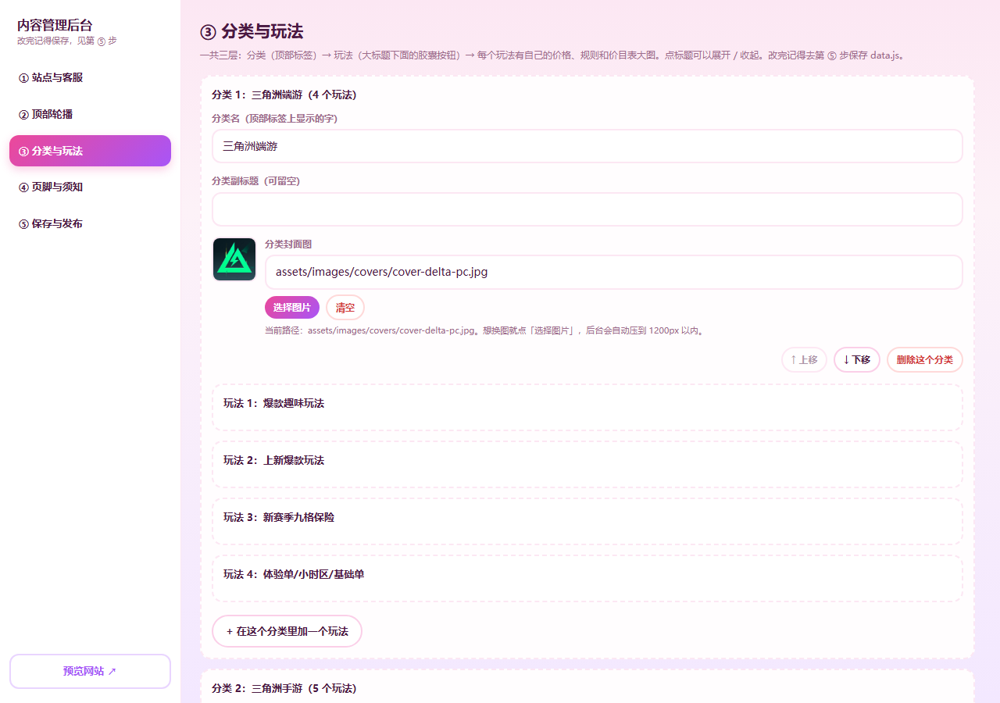

# 云端后台 · 员工操作说明

> 这份是给**客服 / 运营**看的。不用装任何软件，手机、电脑都能改。
> 记住一句话就够了：
>
> ## 打开后台 → 登录 → 改 → 点「发布到网站」→ **刷新网站就能看到**。

---

## 〇、网址和账号

| | |
| --- | --- |
| **后台网址** | **<https://chenxing-admin.pages.dev>** |
| **网站** | <https://www.chenxingg.cn> |
| **你的账号密码** | 由管理员单独发给你（管理员账号不要外传） |

> 登录状态能保持 **7 天**。密码可以自己改（见第五节），忘了找管理员重置。

---

## 一、怎么进后台

### 电脑上

1. 浏览器打开后台网址（管理员会发给你，长这样：`https://chenxing-admin.pages.dev`）
2. 输入**账号**和**密码** → 点「登 录」

### 手机上（推荐加到桌面，以后一点就进）

**iPhone（Safari）**：打开后台网址 → 底部「分享」按钮 → 「添加到主屏幕」
**安卓（Chrome）**：打开后台网址 → 右上角「⋮」→ 「添加到主屏幕」


> 登录状态会保留 **7 天**，这段时间内不用反复输密码。
> 超过 7 天再点「登录」重新输一次就行。

---

## 二、界面长什么样

左边（手机上在顶部）有 5 个栏目：

| 栏目 | 管什么 |
| --- | --- |
| **① 站点与客服** | 浏览器标题、页面底色、**下单弹层的二维码和微信号**、底部两个按钮的文字 |
| **② 顶部轮播** | 首页最上面那张大图 |
| **③ 分类与玩法** | **最常用**：分类名、玩法名、价格、规则、各种图片 |
| **④ 页脚与须知** | 页面最下面的宣传语、联系方式、备案号、「板板须知」长图 |
| **⑤ 保存与发布** | 改完在这里点「发布到网站」 |



> 带三角的标题**点一下可以展开 / 收起**，不要被一长串列表吓到。

---

## 三、最常用的几个操作

### 1. 改价格

1. 左边点 **③ 分类与玩法**
2. 找到那个分类，**点一下展开**
3. 再找到那个玩法，**点一下展开**
4. 找到 **「价格」** 区域：
   - 想加一个价格 → 点 **「+ 加一个价格」**，三个框依次填：**名称**（如 `双培`）、**价格**（如 `70`）、**单位**（如 `/h`）
   - 想改 → 直接在框里改
   - 想删 → 点右边的红色 **×**
5. 左边点 **⑤ 保存与发布** → 点 **「发布到网站」**

> 💡 价格填**纯数字**（如 `70`）会自动显示成 `¥70`；
> 填 `送20`、`半价` 这种描述就原样显示，不会乱加 ¥ 符号。

### 2. 改规则（板板须知那类文字）

1. 同样展开到那个玩法
2. 找到 **「规则」** 那个大文本框
3. 直接打字，**按回车就是换行**，网站上也跟着换行
4. 懒得一条条写 → 点 **「填入常用规则模板」**，会自动套用管理员设好的模板
5. 发布

> 规则留空 → 网站上**不会显示**「规则」那一块，干干净净，不会留白框。

### 3. 换图片（不用碰任何文件）

1. 找到要换的那张图（比如分类封面图）
2. 点 **「选择图片」**，从手机相册 / 电脑里挑一张
3. 后台会**自动压缩**到合适尺寸，并提示「新图已就绪」
4. 点 **「上传这张图」**
5. 看到「图片已上传」提示后，去 **⑤ 保存与发布** 点 **「发布到网站」**

> ⚠️ **第 5 步别忘了**：图片传上去了，但路径要发布之后才对网站生效。

### 4. 改客服微信号 / 二维码

1. 左边点 **① 站点与客服**
2. 往下找到 **「客服微信与下单弹层」**：
   - **客服微信号** → 直接改
   - **客服二维码图片** → 点「选择图片」→ 选图 → 点「上传这张图」
   - 弹层上的说明文字、按钮文字，也都在这一块
3. 发布

### 5. 加一个玩法 / 加一个分类

- **加玩法**：展开对应分类 → 拉到最下面 → 点 **「+ 在这个分类里加一个玩法」** → 改名字、传图、填价格
- **加分类**：③ 页面最下面 → 点 **「+ 添加一个新分类」**
- **调顺序**：每个分类 / 玩法右下角都有 **「↑ 上移」「↓ 下移」**
- 改完都要**发布**

> ⚠️ **红色的「删除」按钮不要乱点**。删了就真的没了（虽然管理员能帮你从版本历史里找回来，但麻烦）。
> 点的时候会先问你一次，看清楚再确认。

---

## 四、发布（最关键的一步）

改完之后，**左边点 ⑤ 保存与发布**：


1. **先看一眼「待发布的改动」** —— 这里列着你改过的每一处，确认没改错
2. 想写备注就写（可以不写，比如「调整三角洲价格」）
3. 点 **「发布到网站」**
4. 看到 **「已发布！刷新网站即可看到」** 就成了

> **不发布 = 白改**。所有改动都存在后台里，只有点了「发布到网站」才会真的更新到网站上。
> 中途关掉浏览器没关系，改动还在（下次进来接着发布）。

---

## 五、改错了怎么办

### 方法一：版本回退（只有管理员能点）

**⑤ 保存与发布 → 点「查看版本历史」** → 找到想回到的那一版 → 点 **「回退到这一版」**。

> 每次发布都会自动留一个版本，可以一直往前翻。
> 回退也是「往前提交一次」，不会删掉历史，所以回退本身也能再回退。

### 方法二：找管理员

跟管理员说「**我不小心改了 XX，帮我回退一下**」就行。

---

## 六、常见问题

| 现象 | 怎么办 |
| --- | --- |
| 点了「发布到网站」没反应 | 看按钮是不是灰的 —— 灰的说明**没有未发布的改动**，先回去改点东西 |
| 发布成功了，但网站上没变化 | 等 1~2 分钟再刷新；手机浏览器要**下拉刷新**（可能是缓存） |
| 图片传上去了，网站上还是旧图 | 忘了点「发布到网站」；或者浏览器缓存，强制刷新一下 |
| 登录说「账号或密码不对」 | 密码输错 10 次会被锁 15 分钟，等一下再试；忘了密码找管理员重置 |
| 被踢回登录页了 | 登录 7 天会过期，重新登一次 |
| 手机上看不清 / 点不到 | 把手机横过来，或者用电脑改 |
| 提示「内容检查没通过：xxx」 | 按提示改（比如某个玩法没写名字、id 重复了），改完再发布 |
| 页面卡住不动 | 下拉刷新页面，改动不会丢（没发布的话还在后台） |

---

## 七、几条规矩（重要）

1. **只改自己负责的部分** —— 别顺手删别人加的东西
2. **删除按钮慎重** —— 删之前想清楚
3. **改了要发布**，不然别人看不到
4. **发布前看一眼「待发布的改动」清单** —— 确认都是你想改的
5. **账号不要互相借用** —— 每次发布都会记下是谁改的，方便追查也方便回退
6. **不确定的操作先问管理员**，不要自己试

---

## 八、给管理员的备注

- 员工账号分两种角色：
  - **编辑（editor）**：能改内容和发布，**不能**回退版本、不能管账号 —— 员工给这个
  - **管理员（admin）**：全部权限 —— 只给自己
- 开账号 / 重置密码 / 删账号：

  ```bash
  node cloud/开账号.mjs list                 # 看现有账号
  node cloud/开账号.mjs add kefu01           # 新增编辑员（自动生成密码）
  node cloud/开账号.mjs passwd kefu01        # 重置密码
  node cloud/开账号.mjs remove kefu01        # 删除账号
  ```

- **账号被离职员工带走怎么办**：用 `remove` 删掉，或 `passwd` 换个新密码即可，旧密码立刻失效。
