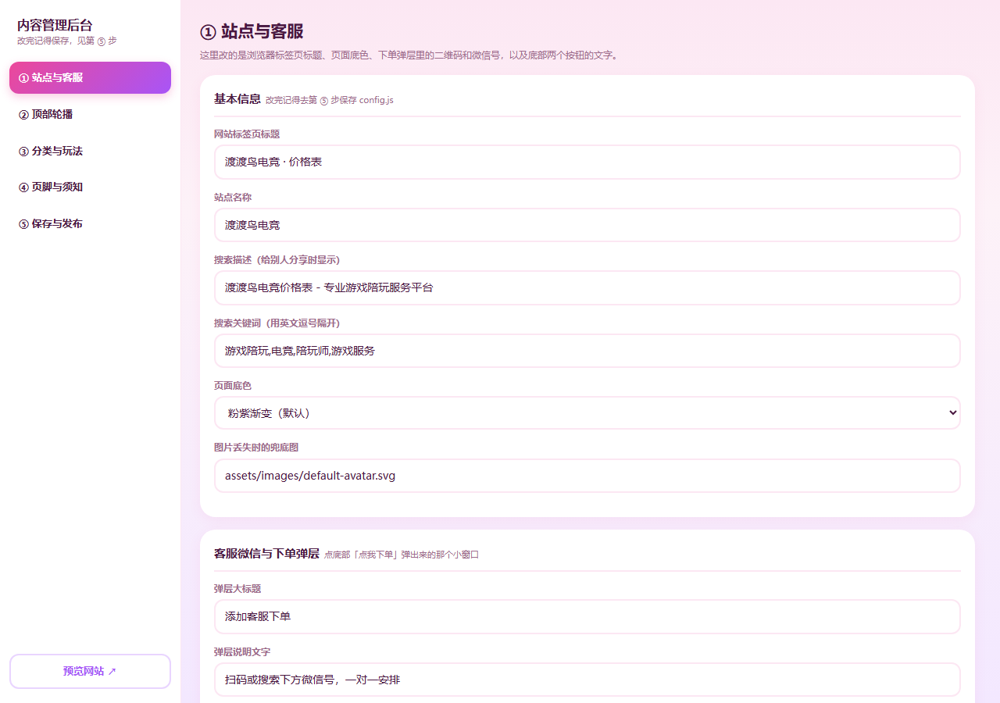

# 新手操作手册

> 这份手册写给完全不懂代码的人。照着做就行，不需要安装任何软件。

---

## 〇、先记住一句话

> **改内容 = 双击 `admin.html` → 左边选栏目 → 右边改 → 点第 ⑤ 步保存 → 刷新 `index.html`。**

就这样，没有别的。

---

## 一、第一次打开

1. 打开电脑上的文件夹：`DEEPSEKK` → `dduniao-clone`
2. 找到 **`admin.html`**，**双击**它（会用你的默认浏览器打开，推荐 Edge 或 Chrome）
3. 左边出现一排菜单，右边是要改的内容



最下面有个 **`预览网站 ↗`** 按钮，随时点它就能看到当前网站长什么样（会新开一个标签页）。

---

## 二、后台有 5 个栏目

| 栏目 | 管什么 |
| --- | --- |
| **① 站点与客服** | 浏览器标签页标题、页面底色、下单弹层的二维码和微信号、底部两个按钮的文字 |
| **② 顶部轮播** | 首页最上面那张大图（可以放多张自动轮播） |
| **③ 分类与玩法** | 顶部分类标签、每个玩法的名称、图标、价目表大图、价格、规则 |
| **④ 页脚与须知** | 页面最下面的紫色区域：宣传文案、联系方式、备案号、「板板须知」长图 |
| **⑤ 保存与发布** | 把改动保存成文件，以及告诉你要放到哪里 |

---

## 三、场景演练

### 场景 1：把客服微信号换成我自己的

1. 左边点 **① 站点与客服**
2. 找到 **「★ 客服微信号」** 这一栏，把里面的 `duduniao-game888` 删掉，填你自己的微信号
3. 左边点 **⑤ 保存与发布**
4. 你会看到「本次改了 1 处：站点设置 · 微信号」
5. 点 **「下载 config.js（设置）」**
6. 浏览器会下载一个叫 `config.js` 的文件（一般在「下载」文件夹里）
7. 打开网站文件夹 `dduniao-clone` → `assets` → `js`
8. 把下载到的 `config.js` **拖进这个 `js` 文件夹**，弹出提示时选 **「替换目标中的文件」**
9. 回到网站文件夹双击 `index.html`，点底部的「点我下单 ♡」，看看微信号变了没

> **如果你的浏览器是 Edge 或 Chrome**，第 5 步可以改点 **「直接覆盖保存 config.js」**：
> 第一次会让你选文件位置（选到 `dduniao-clone\assets\js\config.js`），
> 以后每次点一下就直接写进去了，不用再手动拖文件。

---

### 场景 2：换一张图片

图片比文字多两步，因为后台没法直接往你硬盘里写文件，需要你帮忙搬一下。

1. 找到要换的那张图（比如左边点 **③ 分类与玩法** → 展开某个分类 → 点「分类封面图」）
2. 点 **「选择图片」**，从你电脑里挑一张新图
3. 后台会自动把它**压缩到合适尺寸**（封面 1200px、图标 420px、价目表大图 1000px），
   并把路径自动填好，同时下方出现一行红字提示，告诉你**新图叫什么名字、要放到哪个文件夹**
4. 点 **「下载这张图」** → 浏览器下载一个图片文件
5. 把下载到的图片，拖进提示里说的那个文件夹（一般是 `dduniao-clone\assets\images\` 或里面的 `covers` 子文件夹）
6. 弹出提示时选 **「替换目标中的文件」**
7. **再回到第 ⑤ 步保存一次 `data.js` 或 `config.js`**（因为图片路径也算一处改动）
8. 刷新网站看效果

> **小贴士**
> - 名字不用你自己想，后台已经取好了，你只要「替换同名文件」就行，位置绝对不会搞错。
> - PNG 图会保持透明背景，其它格式会自动转成 JPG（体积小、加载快）。
> - **换错了怎么办？** 再按一次流程，选回原来那张图就行，不会弄坏什么。

---

### 场景 3：给某个玩法加上文字价格

原站只能看图上的价格。想在海报卡上显示大字价格（像 `¥70 /h` 这样）：

1. 左边点 **③ 分类与玩法**
2. 展开到你要改的那个玩法（点玩法标题那一行展开）
3. 找到 **「价格」** 区域，点 **「+ 加一个价格」**
4. 三个框依次填：**名称**（如 `双培`）、**价格**（如 `70`）、**单位**（如 `/h`）
   - 纯数字会自动加上 `¥` 符号
   - 填「送20」「半价」这种描述，就原样显示，不会乱加符号
5. 左边点 **⑤ 保存与发布** → 下载 `data.js` → 覆盖到 `assets\js\data.js`
6. 刷新网站

> 不想要价格框？把那一行删掉就行。**一个价格都不填的话，海报上不会出现空白框。**

---

### 场景 4：写规则文字

1. 同样在 **③ 分类与玩法** 里展开某个玩法
2. 找到 **「规则」** 那个大文本框
3. 直接打字，**按回车就是换行**，前台也会跟着换行显示
4. 懒得一条条写？点 **「填入常用规则模板」**，会自动套用你在第 ④ 步设置的模板
5. 保存 `data.js` → 覆盖 → 刷新

> 规则留空的话，海报上不会显示「规则」这一块，干干净净。

---

### 场景 5：加一个新玩法 / 新分类

- **加玩法**：展开对应分类 → 点最下面的 **「+ 在这个分类里加一个玩法」** → 改名字、传图、填价格
- **加分类**：拉到第 ③ 页最下面 → 点 **「+ 添加一个新分类」**
- **调整顺序**：每个分类 / 玩法右下角都有 **「↑ 上移」「↓ 下移」**
- **删除**：点红色的 **「删除这个分类」/「删除这个玩法」**（会先问你一次，防误删）

改完记得保存 `data.js`。

---

### 场景 6：换顶部大轮播

1. 左边点 **② 顶部轮播**
2. 每一张轮播可以单独设置：
   - **图片**：点「选择图片」换图（建议横图，宽度 1600px 左右）
   - **大标题 / 小字**：显示在图片左下角的文字，**留空就不显示**
   - **显示方式**：
     - 「完整显示整张图」→ 图片自带文字时选这个（推荐）
     - 「铺满裁切」→ 图片是纯画面时选这个
   - **点击跳转**：点这张图跳到哪个分类
3. 可以「上移 / 下移 / 删除」，也可以「+ 添加一张轮播图」
4. 下面还能设「自动轮播」开关和切换秒数
5. 保存 `config.js` → 覆盖 → 刷新

> **只想放一张图不轮播？** 那就只留一张，把「自动轮播」的勾去掉，页面会自动隐藏左右箭头和圆点。

---

### 场景 7：品牌名（已统一，但有一处改不掉）

站里的品牌名已经**全站统一成「辰兴电竞」**了（访客能看到的 10 处都改过），这块你不用再管。

**只有一处改不掉：底部那张「板板须知」长图。**

图片里的字是**印在图片上的**，后台改不了，图上还留着原品牌的字样。
想彻底换成自己的，得**重新做一张 1280px 宽的长图**，然后：

1. 后台 → ④ 页脚与须知 → 底部「板板须知」长图 → 点「选择图片」
2. 选你新做的长图 → 点「下载这张图」
3. 把下载到的文件放进 `assets\images\`，覆盖同名文件
4. 回第 ⑤ 步保存 `config.js`

> 做新图的要点：**宽度保持 1280px**（否则底部横幅高度会变），高度随意，内容写你自己的规则须知。
> 用飞书文档 / Canva / PPT 导出长图都可以。

> **以后想把品牌名再换成别的**，去后台这 5 个地方：
> ① 站点与客服的「网站标签页标题」「站点名称」「全部视图大标题」；
> ④ 页脚与须知的「品牌名」「官方公众号」「版权行」。
> 分类名 / 玩法名里的品牌字样，在 ③ 分类与玩法里改。

---

### 场景 8：删错了 / 存错了，怎么找回来（后悔药）

后台**每次点保存之前，都会自动把当前内容整份存进浏览器里**（最多留 8 版）。

回到 **⑤ 保存与发布**，拉到最下面，你会看到 **「自动存档（后悔药）」**：

- 每一行是一条存档，写着时间、是什么操作之前存的、当时有几个分类
- 点 **「恢复这一版」** → 页面内容立刻回到那一刻（**会自动先存一份当前的，所以这一步也能反悔**）
- 恢复之后，**记得再去点一次保存**，否则文件里还是旧的

> 什么时候用得上：
> - 手滑连点了「删除这个分类」，一下子少了好几个
> - 存了一版不满意的内容，想回到刚才那版
> - 想看看「刚拿到文件时的原始样子」——最下面那条「初始版本」就是
>
> **注意**：存档存在**你这台电脑的这个浏览器**里。换电脑、换浏览器、清理浏览器数据，存档就没有了。
> 所以真正重要的内容，还是要按第七条老老实实做文件夹备份。

---

## 四、保存这件事，说清楚

后台**不会偷偷改你的文件**，所有改动都要你亲手保存。规则很简单：

| 你改了什么 | 要保存哪个文件 |
| --- | --- |
| 分类、玩法、价格、规则、封面图、轮播图 | **`data.js`** |
| 客服微信、标题、底色、按钮文字、页脚、备案号、板板须知 | **`config.js`** |
| 两边都改了 | **两个都要保存** |

第 ⑤ 步会把「要保存哪个」直接写给你看，不会记错。

**保存的两个办法：**

| 办法 | 怎么做 | 适合谁 |
| --- | --- | --- |
| **下载 + 覆盖** | 点「下载 xxx.js」→ 拖进 `assets\js\` → 选「替换目标中的文件」 | 所有人，最稳 |
| **直接覆盖保存** | 点「直接覆盖保存 xxx.js」→ 第一次选一下文件位置 | Edge / Chrome 用户，更省事 |

> **⚠️ 「直接覆盖保存」是真的直接写进你电脑的文件**，没有第二次确认。
> 所以点之前先看一眼「第 1 步」列出来的改动清单对不对。
> **万一存错了，去第 ⑤ 步最下面的「自动存档（后悔药）」恢复**（见场景 8）。

> **发现改错了 / 不想要了？**
> 第 ⑤ 步最下面有个 **「放弃所有改动，重新载入」**，点一下就把所有改动扔掉，回到文件里的样子。

---

## 五、改完怎么检查

刷新 `index.html`，重点看这几处：

1. 顶部轮播是不是你要的图
2. 分类标签（那一排胶囊按钮）对不对
3. 点一个玩法，下面的海报卡和价目表大图是不是对应的
4. 点底部 **「点我下单 ♡」**，二维码和微信号对不对
5. 底部「板板须知」和页脚文案对不对

手机效果怎么看？在浏览器里按 **`F12`** 打开开发者工具，点左上角的手机图标，
或者直接把浏览器窗口拖窄到手机宽度，大致能看出来。

---

## 六、出问题了怎么办

| 现象 | 原因 | 怎么修 |
| --- | --- | --- |
| 打开 `index.html` 一片空白，什么都没有 | `data.js` 或 `config.js` 被改坏了 | 用 `_v1备份` 之外的备份替换回来；或者删掉这两个文件，重新打开后台保存一次 |
| 页面能打开，但某张图是默认小头像 | 图片路径写错了，或图片文件不在那个位置 | 回后台看那个图片字段的路径，确认文件真的在那个文件夹里，文件名大小写也要一致 |
| 后台打不开 / 打开是白屏 | `admin.html` 没和 `assets` 文件夹在一起 | 确认 `admin.html` 就在 `dduniao-clone` 文件夹里，和 `index.html` 并排 |
| 保存后刷新没变化 | 浏览器缓存 | 按 `Ctrl + F5` 强制刷新 |
| 点了「下载」但找不到文件 | 文件进了浏览器的「下载」文件夹 | 在浏览器里按 `Ctrl + J` 打开下载记录，右键「在文件夹中显示」 |
| 图片显示得特别大 / 特别长 | 换的图尺寸不匹配 | 底部板板须知建议保持 1280px 宽；其它图按后台提示的尺寸来 |
| 中文变乱码 | 用记事本之类改过 `data.js` | 别手改这两个文件，只用后台改 |
| **分类 / 玩法少了几个** | 不小心点了红色的「删除这个分类 / 玩法」 | 去 **⑤ 保存与发布 → 自动存档（后悔药）**，恢复上一版（见场景 8） |
| 保存后前台没变化 | 保存的是 `data.js`，但改的是设置（或反过来） | 看第 ⑤ 步「要保存的文件」那一行，两个都要就存两个 |

---

## 七、备份建议（很重要，两分钟的事）

后台虽然好用，但**电脑坏了、文件误删了就全没了**。建议：

1. 在 `dduniao-clone` 文件夹上右键 → **复制**
2. 粘贴到别的地方（比如 D 盘、U 盘、网盘同步目录）
3. 重命名成 `dduniao-clone-备份-2026-10-02`

**什么时候备份？**

- 大改之前（比如准备换一批图）
- 改满意之后，立刻存一份

**要备份哪些东西？**

只要你关心的两块，其它都是程序：

```
dduniao-clone\assets\js\data.js       ← 内容
dduniao-clone\assets\js\config.js     ← 设置
dduniao-clone\assets\images\          ← 所有图片
```

> 有 GitHub 账号的话，把整个 `dduniao-clone` 传到 GitHub 上，就自动有历史版本了，
> 哪天改坏了可以回退。做法见 **[上线部署指南.md](上线部署指南.md)**。

---

## 八、不想用后台了，能直接改文件吗？

能，但**不推荐**。两个文件长这样：

```js
var SERVICE_CATEGORIES = [
  {
    id: 'b193a539aad54a1aadf65294bbd9f742',
    title: '三角洲端游',
    cover: 'assets/images/covers/cover-delta-pc.jpg',
    items: [
      {
        id: 'e2a76c29dabf4760b9bb426b416e0188',
        title: '爆款趣味玩法',
        image: 'assets/images/delta-pc-01-hot-fun.png',
        contentImage: 'assets/images/detail/e2a76c29dabf4760b9bb426b416e0188.jpg',
        prices: [],
        rule: ''
      }
    ]
  }
];
```

看懂了就是：改引号里的文字、换引号里的路径。但**少一个逗号、少一个引号，整个网站就会白屏**，
所以还是用后台更省心。
